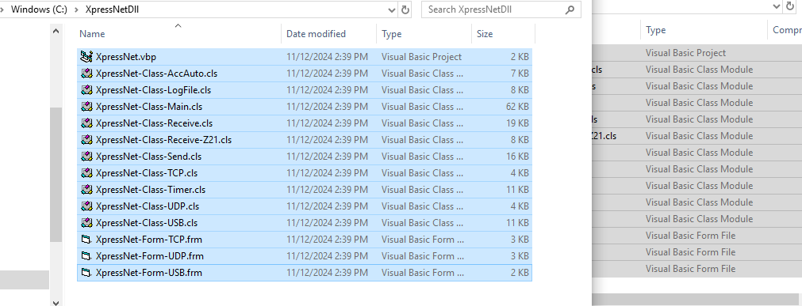
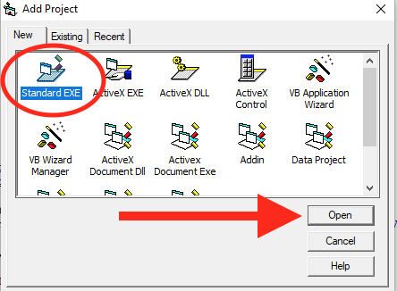
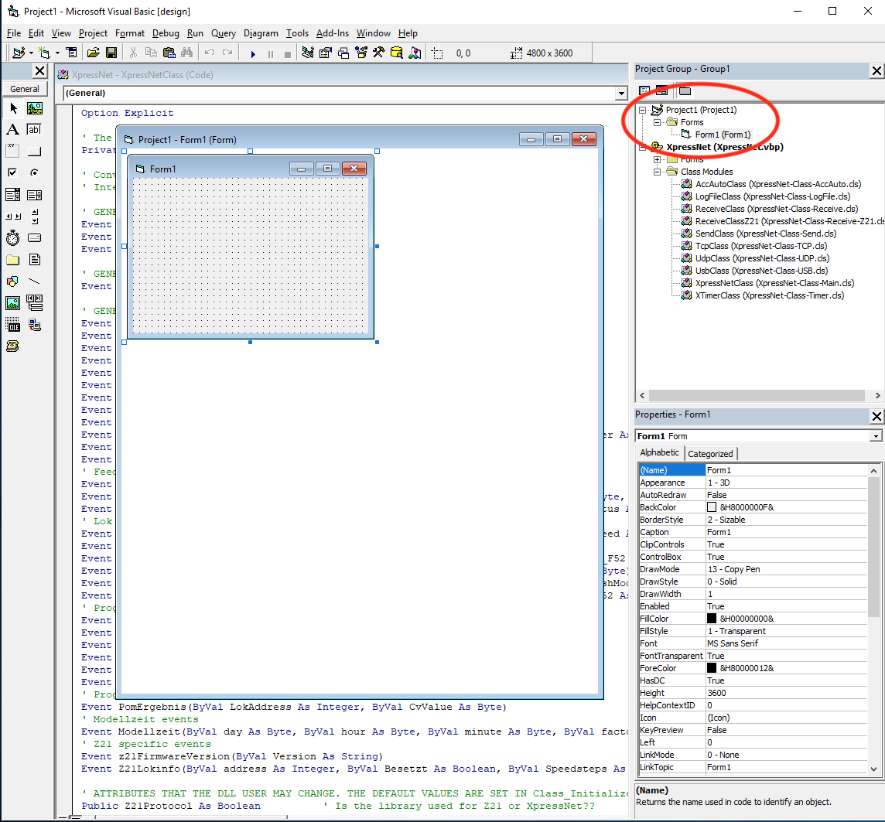

# Voeg de source code toe aan je applicatie
In deze handleiding wordt beschreven hoe je de XpressNet source files onderdeel kunt maken van je bestaande VB6 applicatie.

## Stap 1: Ga naar de GitHub repository ##
Open de browser en ga naar de [XpressNet repository op Gihub](https://github.com/aikopras/XpressNet).
 
  

## Stap 2: Dubbel klik op VB6_Source.zip ##
Navigeer naar de folder met de naam Code en dubbel klik op de file VB6_Source.zip
 
  

## Stap 3: Download als RAW file ##
Klik op de download RAW file icon aan de rechterkant om VB6_Source.zip naar je lokale machine te downloaden.
 
  

## Stap 4: Open VB6_Source.zip ##
Nadat VB6_Source.zip is gedownload naar je lokale Downloads folder, wordt het tijd om de VB6_Source.zip te openen. Afhankelijk van de gebruikte browser, wordt deze optie soms door de browser zelf geboden.
 
  

## Stap 5: Kopieer alle files ##
Nadat de ZIP file is geopened, wordt een nieuw venster geopend met daarin alle files van VB6_Source.zip. Selecteer alle files, en kopieer ze naar de folder die je VB6 applicatie wilt gebruiken.
 
  

Als je applicatie folder de naam "MyApplication" heeft, dan ziet het in de file explorer er als volgt uit.
 
  

## Stap 6: Open XpressNet.vbp ##
Open nu de file met de naam XpressNet.vbp, dus de XpressNet Visual Basic 6 project groep.
 
  

## Stap 7: Add project ##
Om de XpressNet sources in je eigen applicatie programma te kunnen gebruiken, moet eerst een tweede project worden aangemaakt waarin straks de code van je eigen programma komt. In het algemeen zal je programma de vorm van een standard EXE krijgen.
 
 
 
  

## Stap 8: Tweede project groep ##
De tweede project groep is nu aangemaakt, waarin nu de code van je eigen programma gezet kan worden. Verander de naam van deze groep en sla de project groep op.
 
 
 
  
