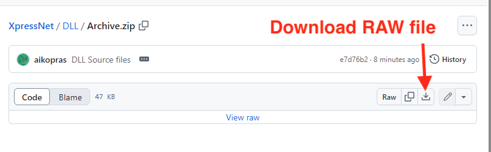

# Voeg de source code toe aan je applicatie
In deze handleiding wordt beschreven hoe je de XpressNet source files onderdeel kunt maken van je bestaande VB6 applicatie.

## Stap 1: Ga naar de GitHub repository ##
Open de browser en ga naar de [XpressNet repository op Gihub](https://github.com/aikopras/XpressNet).
 
  

## Stap 2: Dubbel klik op VB6_Source.zip ##
Navigeer naar de folder met de naam Code en dubbel klik op de file VB6_Source.zip
 
  

## Stap 3: Download als RAW file ##
Klik op de download RAW file icon aan de rechterkant om VB6_Source.zip naar je lokale machine te downloaden.
 
  

## Stap 4: Open VB6_Source.zip ##
Nadat VB6_Source.zip is gedownload naar je lokale Downloads folder, wordt het tijd om de VB6_Source.zip te openen. Afhankelijk van de gebruikte browser, wordt deze optie soms door de browser zelf geboden.
 
  

## Stap 5: Kopieer alle files ##
Nadat de ZIP file is geopend, wordt een nieuw venster geopend met daarin alle files van VB6_Source.zip. Selecteer alle files, en kopieer ze naar de folder die je VB6 applicatie wilt gebruiken.
 
  

Als je applicatie folder de naam "MyApplication" heeft, dan ziet het in de file explorer er als volgt uit.
 
  

## Stap 6: Start een nieuw Standard EXE-project
Open Visual Basic 6.0 en kies **Standard EXE**.

Dit project wordt je eigen applicatie.

## Stap 7: Open het XpressNet-project en kopieer de code
Open ter inzage **XpressNet.vbp** (niet nodig om te runnen).
Ga in je Standard EXE-project naar **Project → Add File…** en voeg de benodigde bronbestanden toe die in **XpressNet.vbp** worden genoemd. Dat zijn alle bestanden waarvan de file extensie eindigt op **.cls** (class modules) en **.frm** (forms).

Sla je eigen project op en sluit daarna **XpressNet.vbp**.

## Stap 8: Compileer en draai je applicatie
Zorg dat **Project → Properties → Startup Object** correct staat (je hoofdformulier of Sub Main).

Kies **File → Make <ProjectName>.exe** om te compileren.
Je krijgt één .exe met alle XpressNet-code ingebouwd. Het registreren van een XpressNet-DLL is niet nodig.
