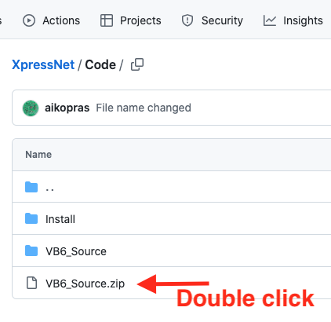

# Add source code to the application
This manual describes how to use the XpressNet Library source code as part of your VB6 application.

## Step 1: Go to the GitHub repository ##
Open your browser and go to the [XpressNet repository on Gihub](https://github.com/aikopras/XpressNet).
 
  

## Step 2: Double Click VB6_Source.zip ##
Go to the directory called Code and double click VB6_Source.zip
 
  

## Step 3: Download as RAW file ##
Click the download RAW file icon at the right to download VB6_Source.zip to your local machine.
 
  

## Step 4: Open the VB6 Source file ##
After the file is downloaded to your local Downloads directory, you must open the received ZIP file. Depending on the browser being used, this may be possible via a pop-up window.
 
  

## Stap 5: Copy all files ##
After the ZIP file is opened, a new window opens showing all files contained within VB6_Source.zip. Select all files, and copy them to the folder you want to use for your own VB6 application.
 
  

If your application folder was called "MyApplication", the file explorer shows the following files.
 
  

## Step 6: Start a new Standard EXE project ##
To use the XpressNet sources in your own application program, you have to open a new Visual Basic 6.0 project (add project) that will later contain the code for your own application. In general your own application program will take the form of a **Standard EXE** .
 
 
 
  

## Step 7: Open the XpressNet project and copy the code ##
Open the file named **XpressNet.vbp**, which is the Visual Basic 6 project group that holds together the various XpressNet source files.
 
  

In your Standard EXE project go to **Project → Add File**

Add all **.frm** and **.cls** files that are present in **XpressNet.vbp**.

You now have all required code directly in your own project. Save your project and close **XpressNet.vbp**.

## Step 8: Compile and run your application ##

Choose **File → Make Project.exe** to compile your program.

You will get a single .exe, containing all code to use XpressNet. Registering an XpressNet DLL is not (any longer) necessary.
