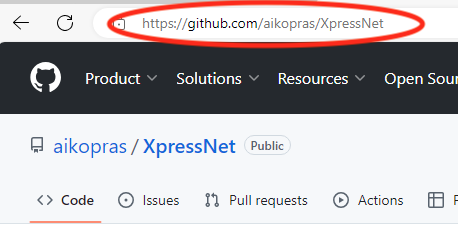
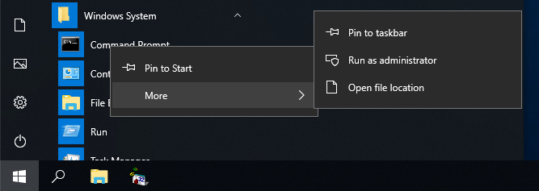
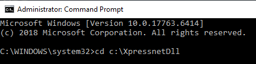
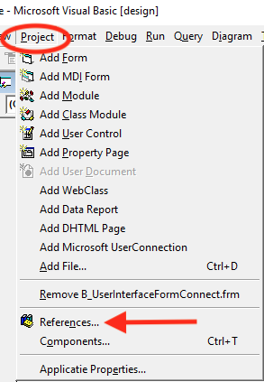

# Download and Install the XpressNet DLL (regsvr32)

## Step 1: Create a directory ##

The first step is to open the File Explorer, and create a directory called XpressNetDll. The location and name of the directory should not be changed later. A good place is directly under C:.
 
  

## Step 2: Go to the GitHub repository ##
Open your browser and go to the [XpressNet repository on Gihub](https://github.com/aikopras/XpressNet).
 
  

## Step 3: Double Click XpressNet.dll ##
Go to the directory called Code and double click XpressNet.dll
 
  

## Step 4: Download as RAW file ##
Click the download RAW file icon at the right to download XpressNet.dll to your local machine.
 
  

## Step 5: Save XpressNet.dll ##
After the file is downloaded (to your local Downloads directory), move the file to the directory you've created in Step 1 above (like C:/XpressNetDll).
 
  

## Step 6: Open the Command prompt as Admin ##
Now that the dll file is downloaded and saved, it is time to register the DLL at your local machine. For that purpose you have to run Command Prompt as Administrator.
Click Windows Start -> Microsoft System followed by a right click on Command Prompt. A windows appears and under More you select Run as Administrator.
 
  

## Step 7: Allow Command as Admin ##
Depending on your version of windows, a window may pop-up, asking you to allow the Windows Command Processor to make changes to your local computer. Click YES.
 
  

## Step 8: Move to the DLL directory ##
Move to the directory where you have stored the XpressNet.dll. This directory should not be renamed or moved later.
 
  

## Step 9: Run regsvr32 ##
Run regsvr32, using XpressNet.dll as argument.
 
 
If everything goes well, a window pops up, saying that registration of XpressNet.dll succeeded.
 
 
If you want to unregister the DLL later, for example because a new version should be registered, you can unregister the DLL using the /u switch.
 
  

## Step 10: Reference the XpressNet DLL ##
Before you can use the XpressNet DLL library in your project, you must create a reference to the DLL. After opening your project click
Project -> References, and select the XpressNet Interface. See both figures below.
  Preferences" width="350"/>
  
 
  
