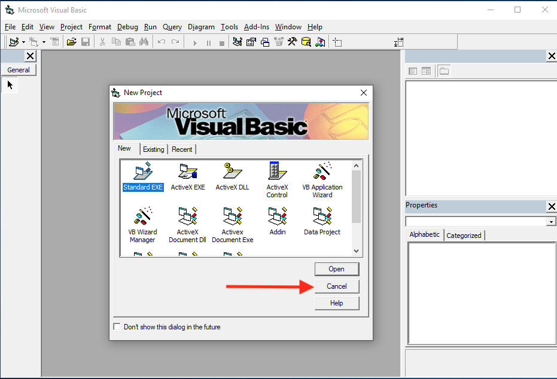
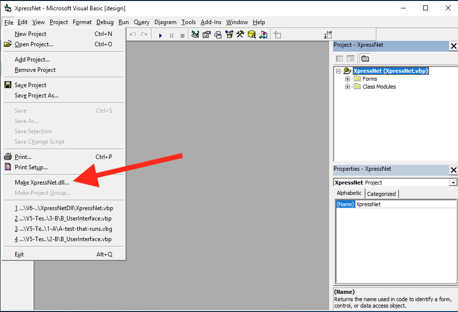
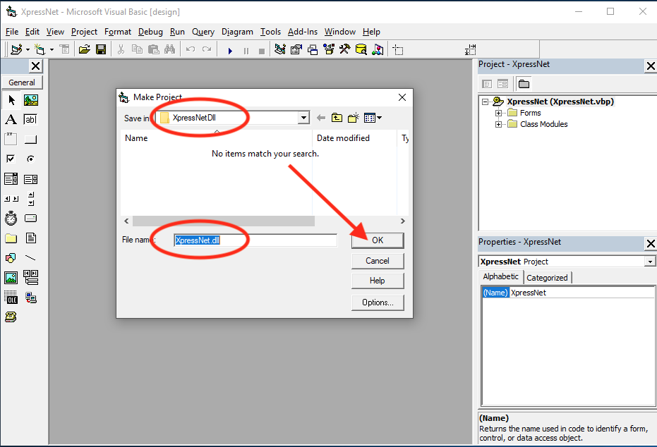

# Download en Installatie van de XpressNet DLL

## Step 1: Make een folder ##

Als eerste wordt de File Explorer geopend, en een nieuwe folder gemaakt met de naam XpressNetDll. De locatie en naam van deze folder mag later niet meer veranderen. Een goede plaats is bijvoorbeeld onmiddellijk onder C:.
 
  

## Step 2: Ga naar de GitHub repository ##
Open de browser en ga naar de [XpressNet repository op Gihub](https://github.com/aikopras/XpressNet).
 
  

## Step 3: Dubbel klik op VB6_Source.zip ##
Navigeer naar de folder met de naam Code en dubbel klik op de file VB6_Source.zip
 
  

## Step 4: Download als RAW file ##
Klik op de download RAW file icon aan de rechterkant om VB6_Source.zip naar je lokale machine te downloaden.
 
  

## Step 5: Open VB6_Source.zip ##
Nadat VB6_Source.zip is gedownload (naar je lokale Downloads folder), klik Open file om VB6_Source.zip te openen.
 
  

## Step 6: Kopieer alle files ##
Een nieuw venster opent, en toont alle files van VB6_Source.zip. Selecteer alle files, en kopieer ze in de folder die je onder Stap 1 hebt gemaakt (bijvoorbeeld C:/XpressNetDll).
 
  

## Step 7: Open VB6 als Administrator ##
Nadat alle files zijn gedownload en in de juiste folder opgeslagen, is het tijd de DLL code te vertalen en te installeren op je eigen computer. Om dit te kunnen doen, MOET VB6 als Administrator geopend worden, zodat het mag schrijven in de Windows Registry.
Klik Windows Start -> Microsoft Visual Studio, gevolgd door een rechter muis klik op Microsft Visual Basic 6. Een nieuw menu opent zich, en onder More wordt gekozen voor Run as Administrator.
 
  

## Step 8: VB6 als Administrator toestaan ##
Afhankelijk van de versie van windows die je hebt, kan een nieuw venster geopend worden waarin gevraagd wordt of VB6 toegestaan wordt om veranderingen (in de registry) van je computer uit te voeren. Selecteer YES.
 
  

## Step 9: VB6 wordt geopend als Nieuw Project ##
Afhankelijk van je VB6 preferences, kan een window geopend worden waarin gevraagd wordt of je een nieuw VB6 project wilt openen.. Kies Cancel.
 
  

## Step 10: Open het XpressNet project ##
Open het VB6 DLL project (XpressNet_vbp), welke je in Stap 6 hierboven hebt opgeslagen (in C:/XpressNetDll).
 
  

## Step 11: Make XpressNet.dll ##
Klik File -> Make XpressNet.dll, om de DLL code te vertalen.
 
  

## Step 12: Save en registreer de DLL ##
Na de vorige stap wordt gevraagd waar de DLL file moet worden opgeslagen. Kies de folder waarin ook de source files zijn opgeslagen, en die later niet meer wordt verplaatst. Onzichtbaar voor de gebruiker zal VB6 ook de DLL in de Windows Registry registreren. Hierdoor kunnen alle VB6 programma's van de DLL gebruik maken. Je bent nu klaar met het installeren van de DLL.
 
  

## Step 13: Reference de XpressNet DLL ##
Voordat de XpressNet DLL library in je eigen programma gebruikt kan worden, moet je vanuit je programma een referentie leggen naar de DLL. Nadat je eigen programma is geopend, klik op Project -> References, en selecteer het XpressNet Interface. Zie beide onderstaande plaatjes.
  Preferences" width="350"/>
  
 
  
