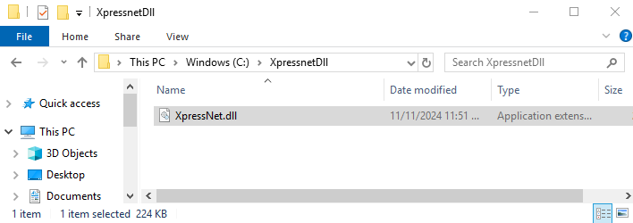

# Download en Installatie van de XpressNet DLL (regsvr32)

## Step 1: Make een folder ##

Als eerste wordt de File Explorer geopend, en een nieuwe folder gemaakt met de naam XpressNetDll. De locatie en naam van deze folder mag later niet meer veranderen. Een goede plaats is bijvoorbeeld onmiddellijk onder C:.
 
  

## Step 2: Ga naar de GitHub repository ##
Open de browser en ga naar de [XpressNet repository op Gihub](https://github.com/aikopras/XpressNet).
 
  

## Step 3: Dubbel klik op XpressNet.dll ##
Navigeer naar de folder met de naam Code en dubbel klik op de file XpressNet.dll
 
  

## Step 4: Download als RAW file ##
Klik op de download RAW file icon aan de rechterkant om XpressNet.dll naar je lokale machine te downloaden.
 
  

## Step 5: Save XpressNet.dll ##
Nadat XpressNet.dll is gedownload (naar je lokale Downloads folder), verschuif de DLL file naar de folder die je hebt gemaakt under stap 1 hierboven ((b.v. C:/XpressNetDll).
 
  

## Step 6: Open de Command prompt als Admin ##
Nadat de DLL file is opgeslagen, wordt het tijd de DLL te registreren op de locale machine. Hiertoe moet de Windows Command Prompt met Administrator rechten worden opgestart.
Klik Windows Start -> Microsoft System, gevolgd door een rechter muis klik op Command Prompt. Een nieuw venster verschijnt en onder More kan worden gekozen voor Run as Administrator.
 
  

## Step 7: Bevestig dat wijzigingen zijn toegestaan ##
Afhankelijk van de versie van windows, wordt er een nieuw venster geopend, met daarin de vraag of de Windows Command Processor veranderingen mag aanbrengen op je locale computer. Klik YES.
 
  

## Step 8: Ga naar de DLL folder ##
Ga naar de directory waar de XpressNet.dll is opgeslagen (cd c:\XpressnetDll). Deze folder mag later niet verplaats worden of een andere naam krijgen..
 
  

## Step 9A: Start regsvr32 op een 32-bit systeem ##
Start regsvr32, met XpressNet.dll als argument, voor 32 bits applicaties (zie de Appendix onderaan deze pagina).
 
 
Als alles goed gaat, verschijnt er een window die zegt dat registratie van XpressNet.dll is gelukt.
 
 
Als je later de DLL weer uit de windows registry wilt verwijderen, omdat er bijvoorbeeld een nieuwe versie is verschenen, moet regsvr32 opnieuw worden aangeroepen, maar met /u als switch.
 
  

## Step 9B: Start regsvr32 op een 64-bit systeem ##
Start regsvr32, met XpressNet.dll als argument, voor 64 bits applicaties (zie de Appendix onderaan deze pagina). Aangezien de XpressNet DLL een 32-bits COM-component is, moet je op een 64-bits versie van Windows de 32-bits versie van regsvr32 gebruiken, die zich bevindt in C:\Windows\SysWOW64. Het uitvoeren van de 64-bits versie van regsvr32 (in C:\Windows\System32) zal niet werken.
 
 
Als alles goed gaat, verschijnt er een window die zegt dat registratie van XpressNet.dll is gelukt.
 
 
Als je later de DLL weer uit de windows registry wilt verwijderen, omdat er bijvoorbeeld een nieuwe versie is verschenen, moet regsvr32 opnieuw worden aangeroepen, maar met /u als switch.
 
  

## Step 10: Reference de XpressNet DLL ##
Voordat de XpressNet DLL library in je eigen programma gebruikt kan worden, moet je vanuit je programma een referentie leggen naar de DLL. Nadat je eigen programma is geopend, klik op Project -> References, en selecteer het XpressNet Interface. Zie beide onderstaande plaatjes.
  Preferences" width="350"/>
  
 
  

## Appendix: 32-bit versus 64-bit

**Belangrijk:** Het maakt niet uit of je Windows-versie 64-bit is; beslissend is of **je applicatie** als 32-bit of als 64-bit draait.

- **VB6-applicaties** zijn **altijd 32-bit**.  
  → Stap **9A** is van toepassing: het registreren van de DLL is eenvoudig en de DLL wordt direct in het proces geladen.

- **VB.NET (moderne Visual Basic, bv. VB2019/VB2022)** kan als **32-bit of 64-bit** worden gebouwd:  
  - Als je applicatie **32-bit (x86)** is, kan de XpressNet-DLL direct geladen worden (in-process).  
  - Als je applicatie **64-bit** is, kan de 32-bit DLL **niet** direct geladen worden.  
    Gebruik in dat geval de **[COM+ bridge](2A-Installeren-Dll-Via-Com-Plus.md)** (klik op de link voor nadere instructies).

### Hoe instellen in moderne Visual Studio (VB.NET)

**Visual Studio 2019 / 2022 — .NET Framework (WinForms):**

1. Open het project en ga naar **Project → Properties → Compile**.  
2. Afhankelijk van de Visual Studio versie, kan het nodig zijn om naar de **Advanced Compile Options…** te gaan.  
3. Zet **Target CPU** op **x86**.  
   *(U kunt dit ook doen via **Build → Configuration Manager…** en daar per configuratie Debug/Release de **Platform** op **x86** zetten.)*  
4. Bouw de applicatie opnieuw en start deze.

**Tip:** Je kunt ook **AnyCPU + Prefer 32-bit** gebruiken voor eenvoudige scenario’s, maar **x86** is de meest betrouwbare keuze bij gebruik van een 32-bit COM-DLL.

## Mogelijke problemen

- **Fout 0x80004005 (unspecified error)**  
  Meestal veroorzaakt door het gebruik van de verkeerde `regsvr32`.  
  → Gebruik altijd de 32-bit versie in `C:\Windows\SysWOW64\`.

- **Class not registered**  
  De DLL is niet (correct) geregistreerd.  
  → Voer het `regsvr32` commando opnieuw uit als Administrator.

- **BadImageFormatException (in .NET)**  
  Je applicatie draait als 64-bit en kan de 32-bit DLL niet laden.  
  → Bouw de applicatie als **x86 (32-bit)**, of gebruik de COM+ bridge.
