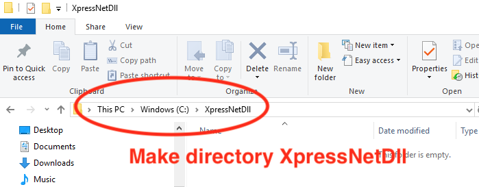
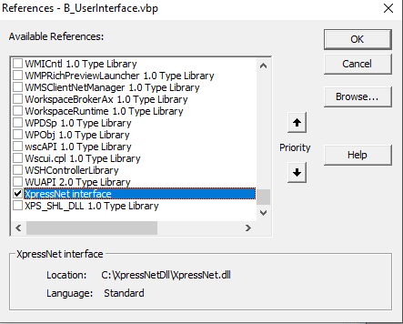

# Download and Install the XpressNet DLL (VB6)

## Step 1: Create a directory ##

The first step is to open the File Explorer, and create a directory called XpressNetDll. The location and name of the directory should not be changed later. A good place is directly under C:.
 
  

## Step 2: Go to the GitHub repository ##
Open your browser and go to the [XpressNet repository on Gihub](https://github.com/aikopras/XpressNet).
 
  

## Step 3: Double Click VB6_Source.zip ##
Go to the directory called Code and double click VB6_Source.zip
 
  

## Step 4: Download as RAW file ##
Click the download RAW file icon at the right to download VB6_Source.zip to your local machine.
 
  

## Step 5: Open the VB6 Source file ##
After the file is downloaded (to your local Downloads directory), click Open file to Open the VB6_Source file.
 
  

## Step 6: Copy files ##
A window opens, showing all the files in the VB6_Source file. Select all files, and copy them to the directory you've created in Step 1 above (like C:/XpressNetDll).
 
  

## Step 7: Open VB6 as Admin ##
Now that all files are downloaded and saved, it is time to make and install the DLL at your local machine. For that purpose you have to run VB6 as Administrator.
Click Windows Start -> Microsoft Visual Studio followed by a right click of Microsft Visual Basic 6. A windows appears and under More you select Run as Administrator.
 
  

## Step 8: Allow VB6 as Admin ##
Depending on your version of windows, a window may pop-up, asking you to allow VB6 to make changes to your local computer. Click YES.
 
  

## Step 9: VB6 opens with New Project ##
Depending on your VB6 preferences, a window may pop-up, asking you if you want to create a new VB6 project. Click Cancel.
 
  

## Step 10: Open the XpressNet project ##
Open the XpressNet_vbp VB6 project, which was stored (in C:/XpressNetDll) in Step 6 above.
 
  

## Step 11: Make XpressNet.dll ##
Click File -> Make XpressNet.dll, to compile the DLL.
 
  

## Step 12: Save and register the DLL ##
In the last step you are asked where the DLL file should be stored. Select the directory in which you have the source files. Under the hood VB6 also registers the DLL in the Windows Registry, allowing any VB6 program to use the DLL. You are now ready with the installation of the DLL.
 
  

## Step 13: Reference the XpressNet DLL ##
Before you can use the XpressNet DLL library in your project, you must reference the DLL. After opening your project click
Project -> References, and select the XpressNet Interface. See both figures below.
  Preferences" width="350"/>
  
 
  
