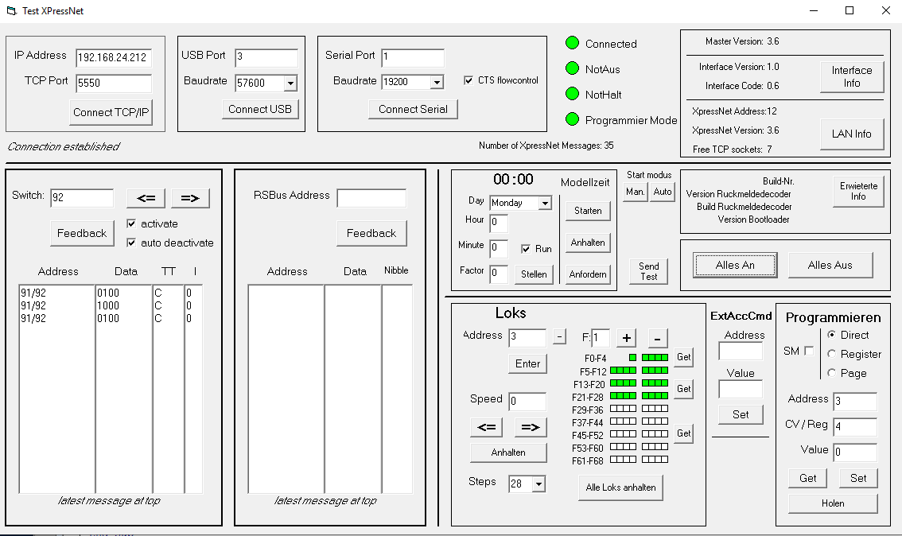
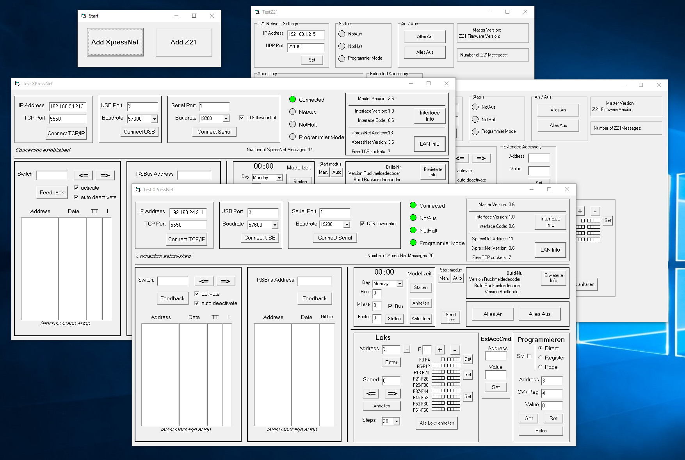
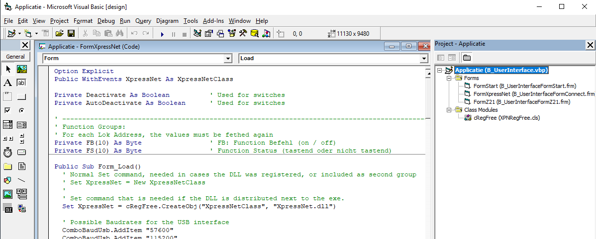
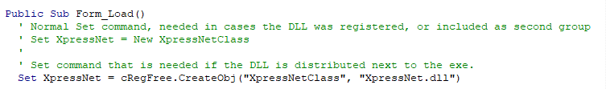
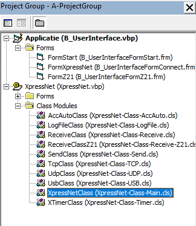

# Examples
This directory contains a number of example applications that demonstrate certain elements of using the XpressNet library.

Except for the last tests, all other test programs assume that the XpressNet DLL is installed in the windows registry. See the installation manual on how to do this registration. Don't forget to provide a Reference to the DLL!

## 1: Basic test ##
Still needs to be added.

## 2: Extended test ##
This test program can be used to test a large number of XpressNet commands, and see which responses are sent by the command station.
 
  

## 3: Z21 Basic test ##
This test program can be used to test a limited number of Z21 commands and see which responses are sent by the command station.
 
  

## 4: Multiple Instance test ##
It is possible to instantiate multiple XpressNet objects within one application. This test program demonstrates this.
 
  

## 5: Regfree test ##
Most of the example programs assume that the XpressNet DLL is registered, not only on the development, but also on the production machines (in the Windows Registry). To do this registration, administrator privileges are required on each machine. On production machines, it is sometimes impossible to obtain administrator privileges. In such cases, the application can also be written “Reg-Free”.

To do this, the XpressNet DLL must be registered on the development environment (i.e. administrator privileges are required on this machine only). The DLL file must also be added to the directory containing the source files as well as a special class file (XPNRegFree.cls). This class file should be added to the own program. See the image below.
 
 

In addition, one line in the source file must be modified. See image below for details. This technique is described in [this entry in the VB6 forum](https://www.vbforums.com/showthread.php?908980-VB6-and-DLLs-Runtime-Error-429-ActiveX-Component-Can-t-Create-Object); with thanks to VanGoghGaming.
 
 

The subdirectory “Result_files-to_distribute” contains the compiled program (.exe file), as well as the DLL. These two files must be put on the production machine (in the same directory), after which the application can be started (without the DLL being registered).

## 6: Project Group ##
This example shows how the application and the XpressNet code can be taken together in one project group. The advantage of this approach is that the XpressNet code is integrated within the application. Therefore, the DLL no longer needs to be installed.
 
  
