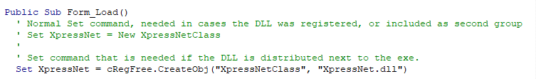
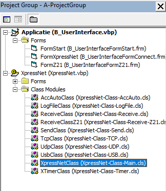

# Voorbeelden
In deze directory staan een aantal voorbeeld applicaties die bepaalde elementen van het gebruik van de XpressNet library tonen.

Behalve bij de laatste test, gaan alle overige test programma's er van uit dat de XpressNet DLL in de windows registry is geïnstalleerd. Zie de installatie handleiding hoe deze registratie kan plaatsvinden. Vergeet niet een Reference naar de DLL te leggen!

## 1-Basic_test ##
Moet nog worden toegevoegd.

## 2-Extended_test ##
Met dit test programma kunnen een groot aantal XpressNet commando's worden getest, en bekeken worden welke responses door de centrale worden verstuurd.
 
  

## 3_Z21_Basic test ##
Met dit test programma kunnen een beperkt aantal Z21 commando's worden getest, en bekeken worden welke responses door de centrale worden verstuurd.
 
  

## 4_Multiple_Instance_test ##
Het is mogelijk om meerdere XpressNet objecten te instantiëren binnen één applicatie. Dit test programma demonstreert dit.
 
  

## 5_Regfree_test ##
Bij de meeste voorbeeld programma's is verondersteld dat de XpressNet DLL niet alleen op de ontwikkel, maar ook op de productie machines (in de Windows Registry) is geregistreerd. Om deze registratie te kunnen doen, zijn administrator rechten nodig op iedere machine. Op productie machines is het soms onmogelijk om administrator rechten te verkrijgen. In dergelijke gevallen kan de applicatie ook "Reg-Free" geschreven worden.

Hiertoe dient op de ontwikkel omgeving de XpressNet DLL geregistreerd te zijn (dus op deze machine zijn wel administrator rechten nodig). Daarnaast moet de DLL file ook worden toegevoegd aan de directory met de source files, alsmede een speciale class file (XPNRegFree.cls). Deze class file dient aan het eigen programma te worden toegevoegd. Zie onderstaand plaatje.
 
 

Daarnaast moet één regel in de source file worden aangepast. Zie onderstaand plaatje voor details. Deze techniek is beschreven in [deze bijdrage in het VB6 forum](https://www.vbforums.com/showthread.php?908980-VB6-and-DLLs-Runtime-Error-429-ActiveX-Component-Can-t-Create-Object); met dank aan VanGoghGaming.
 
 

De subdirectory "Result_files-to_distribute" bevat het gecompileerde programma (.exe file), alsmede de DLL. Deze twee files moeten op de productie machine (in dezelfde directory) worden gezet, waarna de applicatie gestart kan worden (zonder dat de DLL geregistreerd is).

## 6-Project_Group ##
Dit voorbeeld laat zien hoe de applicatie en de XpressNet code samen kunnen genomen in één project groep. Het voordeel van deze aanpak is dat de XpressNet code geïntegreerd wordt binnen de applicatie. De DLL hoeft daarom niet meer geïnstalleerd te worden.
 
  
